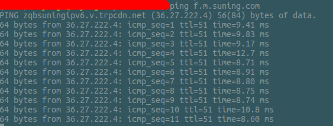

cadolime[kædɑlaɪm]
------------------

>   获取各种动物平台时间：🐱🐶🦁 ，便于抢购某些稀缺商品。

### 使用说明

在终端 `ping` 相应平台域名，已确定网络延时时间：



如上图是苏宁平台的，取 `time` 平均毫秒延时数，大约 `9` ms 。

```plaintext
京东平台可选域名： a.jd.com|www.jd.com|m.jd.com
苏宁平台可选域名： f.m.suning.com|suning.com|m.suning.com
阿里淘宝天猫系可选域名： api.m.taobao.com|taobao.com|tmall.com
```

命令行版本：

```bash
# -p platform: sys/lion/dog/cat 系统|苏宁魔法狮|京东JOY狗|阿里天猫 时间
# -d delay: 10 网络延时时间(ms) <按照上面 `ping` 相应平台域名，确定平均延时>

# 获取当前系统时间
./cadolime(.exe) -p sys -d 0
# 🦁の时 (lion's time) : 获取苏宁魔法狮时间
./cadolime(.exe) -p lion -d 9
# 🐶の时 (dog's time) : 获取京东JOY狗时间
./cadolime(.exe) -p dog -d 20
# 🐱の时 (cat's time) : 获取阿里系淘宝、天猫时间
./cadolime(.exe) -p cat -d 4
```