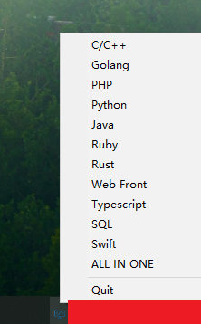

# 在线演练场（online-playground）

[English](readme.md)

>   一个托盘应用，可快速链接到某种或多种语言的在线 `playground` （演练场）地址。

### 截图



### 编译与运行

- 编辑 `playground.json` 配置文件，可以增删一些 `playgrounds`。 
- 对于 `Windows` 已有编译好的名为 `playground.zip` 的 [压缩档](https://github.com/ycrao/learning_golang/releases) ，解压到某一目录，双击 `playground.exe` 即可运行。
- `Linux` 与 `MacOS` 操作系统，需要您自行编译。

应用图标等相关问题请参考：[systray](https://github.com/getlantern/systray) 文档。

```bash
# 在  Windows 下编译
# Windows Powershell
$env:GOOS='windows'; $env:GOARCH='amd64'; go build -ldflags "-s -w -H=windowsgui" -o playground.exe; $env:GOGS=''; $env:GOARCH='';
# Linux 下编译
GOOS=linux GOARCH=amd64 go build -ldflags "-s -w" -o playground
# MacOS 下编译，需要自行打包成 .app 应用，参考 https://github.com/getlantern/systray#macos
GOOS=darwin GOARCH=amd64 go build -ldflags "-s -w" -o playground
```

### 链接

>   感谢以下网站提供在线演练场功能（某些网站可能需要魔法上网，请自行解决）：

- All Playground: [repl.it](https://repl.it/) | [Paiza.io](https://paiza.io/en) | [CodePad:Java/Python/C++14](http://codepad.yenhsuan.xyz/) ...
- C/CPP Playground: [CPlayground](https://cplayground.com/) | [C++Shell](http://cpp.sh/) | [Lab Stack](https://code.labstack.com/cpp) | [TutorialsPoint](https://www.tutorialspoint.com/compile_cpp_online.php) ...
- Golang Playground: [official](https://play.golang.org/) | [go-plus-play](https://play.goplus.org/) | [go-plus-repl](https://repl.goplus.org/) | [study-golang](https://play.studygolang.com/)
- PHP Playground: [PHP Sandbox](https://sandbox.onlinephpfunctions.com/) | [teh-playground](https://www.tehplayground.com/) | [LaravelPlayground](https://laravelplayground.com/#/) | [php-fiddle](http://phpfiddle.org/) | [Fast-Site-PHP](https://www.fastsitephp.com/en/playground) ...
- Web Front(HTML/CSS/Javascript): [codepen](https://codepen.io/) | [jsfiddle](https://jsfiddle.net/) | [PlayCode](https://playcode.io/empty/) ...
- [Typescript Playground](https://www.typescriptlang.org/play/)
- Python Playground: [Jupyter](https://jupyter.org/) | [trinket](https://trinket.io/python) | [Kata Coda](https://www.katacoda.com/courses/python/playground) ...
- Java Playground: [Lab Stack](https://code.labstack.com/java) | [Study Tonight](https://www.studytonight.com/code/playground/java/) ...
- SQL Playground: [db-fiddle](https://www.db-fiddle.com/) | [SQL Fiddle](http://sqlfiddle.com/) | [sql pad](https://sqlpad.io/playground/) ...
- [SwiftPlayground](http://online.swiftplayground.run/)
- RubyPlayground: [official](https://try.ruby-lang.org/playground/) | [Kata Coda](https://www.katacoda.com/courses/ruby/playground) ...
- RustPlayground: [official](https://play.rust-lang.org/) | [TutorialsPoint](https://www.tutorialspoint.com/compile_rust_online.php) ...
- ...

### 参考

- [awesome-playgrounds](https://github.com/ymyzk/awesome-playgrounds)
- [systray](https://github.com/getlantern/systray)
- [2goarray](https://github.com/cratonica/2goarray)